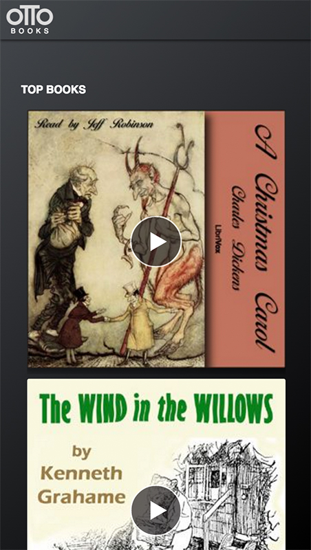

# Otto Books 10k Apart 2016 Contest Entry
Buddy Toups' 10k Apart 2016 contest entry. Otto Books is a simple streaming audio book player powered by Librivox.org.
It uses no plugins all HTML5, CSS3 and JavaScript. The design is responsive and falls back to server-side. If the browser can't support HTML5 audio or MP3 playback it falls back to a simple link to download the MP3 file.

The app uses [Librivox.org's public web APIs](https://librivox.org/api/info#dev_notes).
Librivox.org has thousands of public domain books that volunteers read and recorded for public domain.

## Desktop/Tablet

## Mobile

## Text based/Screen Reader

